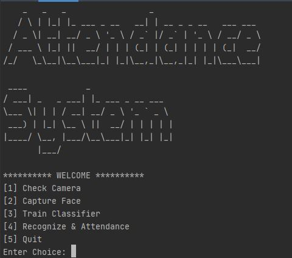
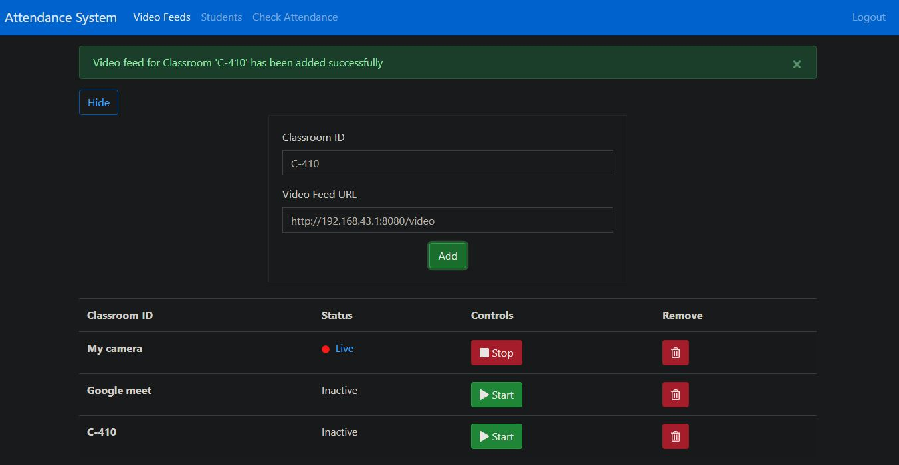

<h1 align="center">Attendance System using Face Recognition</h1>

[](http://hits.dwyl.com/codeglitchz/attendance-system)
<a href="https://github.com/codeglitchz/attendance-system/blob/master/LICENSE" target="_blank">

</a>
<a href="https://github.com/codeglitchz/attendance-system/releases/tag/v2.1.1" target="_blank">

</a>


> A simple, modern and scalable facial recognition based attendance system 
> built with Python back-end & Angular front-end.

[Watch Demonstration Video](https://www.youtube.com/watch?v=9-7uR78ab5c)

## Table of contents
* [Prerequisites](#prerequisites)
* [Installation](#installation)
    1. [Setup backend](#1-setup-backend)
    2. [Setup frontend](#2-setup-frontend)
* [Usage](#usage)\
    a. [Using CLI](#a-using-cli)\
    b. [Using Web Interface](#b-using-web-interface)

## Prerequisites

* Windows or Linux (macOS not officially supported, but might work)
* Nvidia CUDA (optional - for nvidia gpus)
* [CMake](https://cmake.org/download/)
* [Visual Studio Build Tools](https://visualstudio.microsoft.com/downloads/#build-tools-for-visual-studio-2019)
* [Miniconda](https://docs.conda.io/en/latest/miniconda.html) for Python v3.7+
* [Node.js LTS](https://nodejs.org/en/) v12.8.3+ (npm v6.14.6+)
* [Angular CLI](https://cli.angular.io/) v10.1.2+

## Installation

#### 1. Setup backend

Install all dependencies using conda package manager
> Note: This will install the dependencies listed in `environments.yml` file
```sh
$ cd backend
$ conda env create -f environment.yml
```
Now you can activate this environment using the following command
> Note: You can run the app only if this environment is activated
```sh
$ conda activate attendance-system
```

#### 2. Setup frontend
Install all dependencies using npm package manager
> Note: This will install the dependencies listed in `package.json` file
```sh
$ cd frontend
$ npm install
```

## Usage

#### A. Using CLI
Follow these steps to run the app in command line interface mode
* Activate the `attendance-system` conda environment
* Launch `run_cli.py` from the backend directory
```sh
$ cd backend
$ conda activate attendance-system
$ python run_cli.py
```


#### B. Using Web Interface
Start the Flask Web Server 
* Rename `.env.example` file to `.env`
* Activate the `attendance-system` conda environment
* Launch `run.py` from the backend directory
> Note: This will start a flask web server listening on `http://localhost:5000`
```sh
$ cd backend
$ conda activate attendance-system
$ python run.py
```
Launch the Angular Web Application
> Note: This will launch angular web app in browser @ `http://localhost:4200`
```sh
$ cd frontend
$ ng serve -o
```


## 🤝 Contributing

Contributions, issues and feature requests are welcome!<br />Feel free to check [issues page](https://github.com/codeglitchz/attendance-system/issues).

## Show your support

Give a ⭐️ if this project helped you!